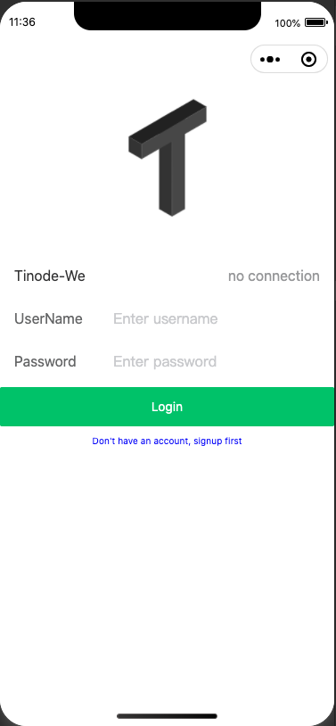
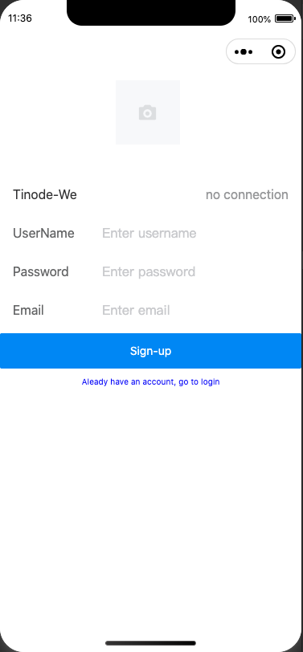
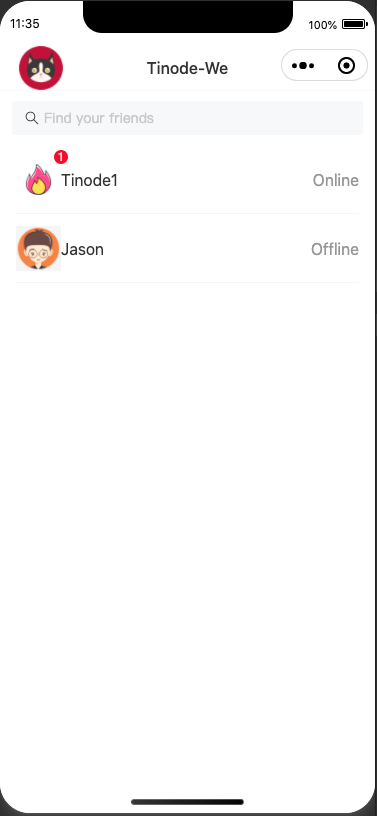
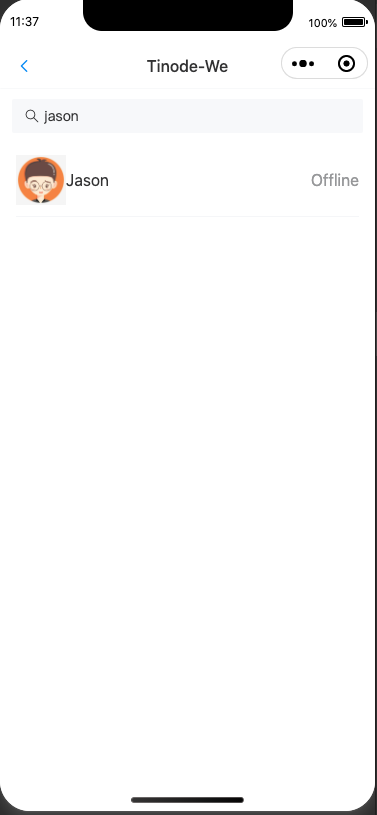
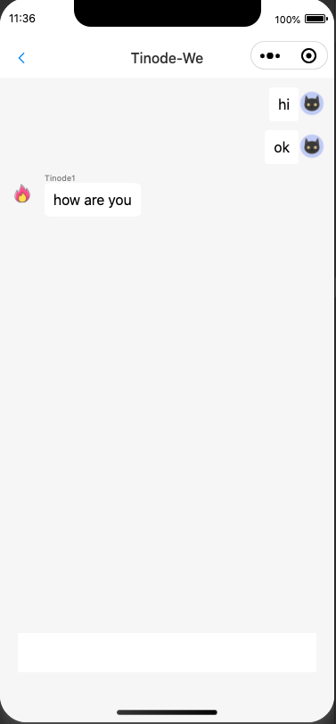

# Tino-We

## 项目简介
Tino-We是一个基于开源IM(Instant Message)项目tinode-chat开发的微信小程序客户端，通过组件Component的形式部署在小程序应用中。现在Github上有很多基于微信小程序的IM应用，但很多应用都是半开源、或者是根据调用量进行收费的，不是很适合只想在小程序中快速搭建一个小型IM服务的项目。本项目想要实现一个轻量化的小程序IM方案，包括可以在云服务器轻松搭建的后端IM服务(Tinode-chat)和前端的Tino-We客户端。本项目还是建设中，功能不是很稳定，后续会不定期更新。

## 快速开始
### 安装和使用
#### 前置准备
- 云服务器 & 公网ip
- 域名 & ssl证书
- 服务器中安装Docker
- 安全组开放后端tinode-chat服务端口

#### 安装后端tinode-chat
tinode-chat的安装可以参考[tinode的文档](https://github.com/tinode/chat/blob/master/INSTALL.md),如果是要安装在非443端口的，可以参考以下[非443安装tinode](https://www.coolister.top/2022/01/21/%e5%9c%a8%e9%9d%9e443%e7%ab%af%e5%8f%a3%e5%ae%89%e8%a3%85tinode-chat-https/)。

#### 小程序配置
小程序后端服务的ip和域名需要在服务器域名中进行配置，需要配置的项目如下：
- request合法域名: https://yourTinodeService.com[:port]; https://img.yzcdn.cn
- socket合法域名: wss://yourTinodeService.com[:port]
- downloadFile合法域名: https://img.yzcdn.cn

#### 安装前端tino-we客户端
1. npm安装vant weapp
2. 复制miniprogram/compoents/tinode-chat-wx组件到小程序项目中
3. 新建一个小程序page，在index.wxml中引入组件
```
<my-im myServerAddress="yourTinodeService.com[:port]" isLocalHost="{{ false }}"></my-im>
```
4. 修改根目录下的app.json
```
{
  "pages": [
    "pages/chat/index"
  ],
  "window": {
    "backgroundColor": "#F6F6F6",
    "backgroundTextStyle": "light",
    "navigationBarBackgroundColor": "#F6F6F6",
    "navigationBarTitleText": "Tinode-We",
    "navigationBarTextStyle": "black",
    "navigationStyle": "custom"
  },
  "sitemapLocation": "sitemap.json",
  "usingComponents": {
    "my-im": "./components/tinode-chat-wx"
  }
```

#### 效果截图
<div display="flex" style="padding=10px">
  
  
  
  
  
</div>

#### 更新记录
- v1.0.0 / 2022-01-24: 实现基础功能（登陆、新建用户、通过ID搜索好友、文字聊天）
- v1.0.1 / 2022-01-24: 修复用户头像加载错误

#### Licenses
- 本项目可以用于学习、交流和非商业项目
